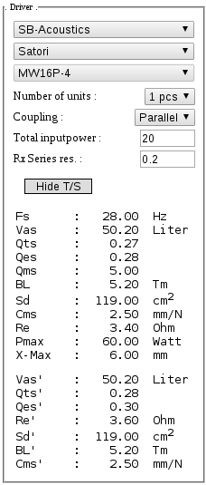
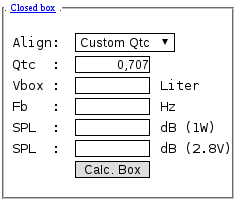
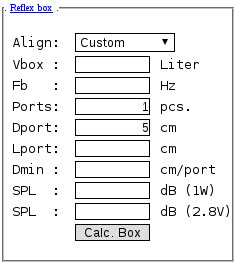
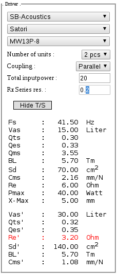
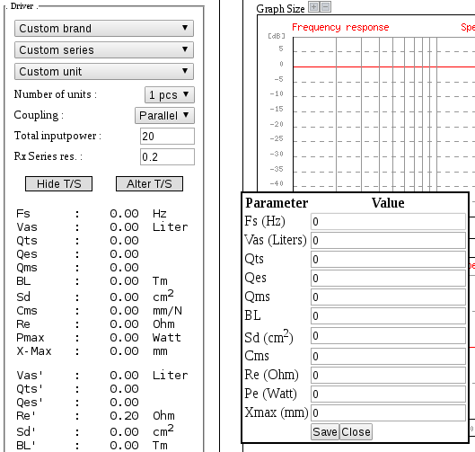

# Speakerbuilder Pro - English

## Introduction
Here you will find documentation for *SpeakerBuilder Pro* in english. We will kepp adding more information as we get the time.

We've split the guide up into the following sections:

- Quick guide
 - Driver selection
 - Closed boxes
 - Refleks boxes
- Special features
 - Multiple units
 - Custom units parameters

## Quick guide
SpeakerBuilder Pro is made by a danish DIY community. Here we will try to help you getting started using out software. The software calculates how closed and reflex boxes behave on a given input like size and port dimension.

### Driver selection
The UI is devided into three main sections. First, in the top left corner we see three dropdown boxes named "Custom brand", "Custom series" and "Custom unit". The first one is where you choose which driver manufactorer you want to work with. Once a manufactorer is choosen, the software fetches the different series of drivers this manufactorer has in the database. Once you choose a series of drivers, the last dropdown box will fetch all the drivers in that series. Now, choose a driver and SpeakerBuilder Pro will fetch the Thiele/Small parameters from our database, and your ready to start calculating.

In the example below, we choose "SB-Acoustics" as our brand, Satori as our series and MW16P-4 as the driver we want to work with. And you can se that SpeakerBuilder Pro populates the Thiele/Small parameters for you. If you want to save screen space, you can hide the parameters by clicking the "Hide t/S" button. The driver section will then collaps and thereby hide the Thiele/Small parameters visually.

> Hint : Both the closed box and reflex box sections has a header ("Closed box" and "Reflex box"). If you click these, the section will collaps and thereby free more screen space.

### Closed boxes
Now we have choosen a spaekerunit to work with, we want to start our calculations. The closed box is the easiest one to work with.

You have four options:
- Choose a Qtc (and then calculate the Box volume)
- Choose a Box volume (and then calculate the Qtc)
- Choose a fix calculation for Butterworth
- Choose a fix calculation for Bessel

In the dropdown box you can tell SpeakerBuilder Pro which of these you want. You can change during calculations if you want. The two last options will give you a fixed calculation based on the two alignments (Butterworth and Bessel). The two first is more dynamic as you can choose a new Qtc can hit Calc. box, or a new box volume and do the same.

Lets say you want to see how a speakerunit performes in a box of 10 liters. Simply choose "Custom Vb". (Vb stands for Volume box). Now enter a value in the vbox field and click the "Calc. box" button.

Now SpeakerBuilder Pro calculates four things for you:
- Qtc - is now calculated
- Fb - box resonant frequency
- SQL - Sound pressure at 1 watt
- SQL - Sound pressure at 2.8 volt

In addition to the above values, it displays some graphs to the right of the screen.
These are :
- Frequency response - The output at each Frequency
- Step response - The response of the loudspeaker to an ideal step
- Excursion - Cone travel at each frequency in milli meters
- Group delay - Delay of each frequency in milli seconds
- Impedance - Impedance at each frequency in ohm

Now we can look at the graphs and see how the speakerunits performes, combined with the calculated Qtc value.

If we instead wanted to choose a Qtc, and calculate the box volume, choose Custom Qtc in the dropdown. Now choose a Qtc value and click "Calc. box".

### Refleks boxes
Lets calculate a box for the driver that has a refleks tuning. In SpeakerBuilder Pro, its only possible to calculate ports, not passive radiators.

In the align dropdown box, you can choose the following ways of calculating the box :
- Custom - Here you enter a box volume and port tuning your self
- Max flat - Gives you a volume and port tuning that gives a max flat freqyency response
- SBB4/BB4 - Offer good transient response, but have larger box, in return of lower Fb
- QB3/SQB3 - Lower F3 for smaller box size. Transient response is not as good as SBB4 or SC4closed
- SC4/C4 - Approx the same size box/F3 as SBB4, but different Fb and lower transient response

All of them, besides the Custom options, gives you a specific value for box volume and port tuning. Some drivers are not suitable for all alignments, and SpeakerBuilder Pro will tell you if you try.

With the custom option you can enter your own volume and port tuning, and click calc. box to see how the speaker unit will performe if given this box. Like the closed box, it will calculate the graphs with frequency response, step response, excursion, group delay, impedance but also port air speed. The last graph (port air speed) calculates the speed of the air inside the port, in the given configuration and input power.

Besides a volume and port tuning, you can enter how many ports you want and the diameter of the ports. When you click calc. box, it will calculate the length requred to obtain the wanted port tuning, given the port diameter and numer of ports. The calculated length is called Lport in SpeakerBuilder Pro. It also calculate the prefered minimum port diameter for you. This is only a guide number, and is called Dmin.

And like in the closed box section, it will calculate SPL in both 1 watt and 2.8 volt for the system.

It also calculates some numbers for you.

## Special features
You can use some of the more advanced features of SpeakerBuilder Pro. It can do calculate on multiple boxes, change input power and you can specify another value for Rx (resistance before the speakerunit like cableing, crossover ect.)

If the driver you want to do calculations on does not exist in our database, you can enter Thiele/Small yourself directly into the UI too.

### Multiple units
In the driver input section you can choose to work on multiple units. Ether in series or parallel. In the Thiele/Small parameters you will get parameters like Qts', Re' and so on. These are the new calculated values for the number of units you choose, and these will be used in all calculation.

In the dropdown box "Number of units" you can choose up to 4 units. SpeakerBuilder Pro will calculate all as either coupled in series or parallel. You can choose which of these in the next dropdown box called "Coupling".

If the total impedance is getting low (<= 3 ohm + Rx), SpeakerBuilder Pro will warn you by writting Re_ in red.

### Custom unit parameters
If you choose "Custom brand" (not choosing a company), and then click the "Alter T/S" a window will appear where you can enter Thiele/Small parameters.
These are provided by your driver manufactorer.

> Hint : Xmax is linear ONE way

 Once you have entered the values, click the save button. Now SpeakerBuilder Pro will do its calculations on your Thiele/Small parameters.
